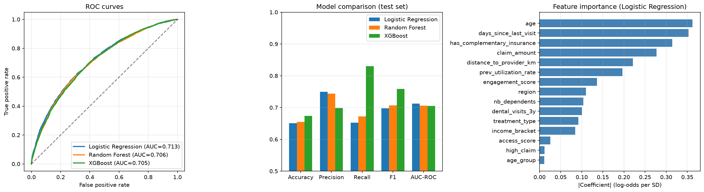

# Dental Care Utilization Prediction

Predicting whether a beneficiary will use their dental care allowance using machine learning classification models.

## Context

Healthcare organizations allocate budgets for dental care benefits. However, not all approved benefits are actually used, leading to suboptimal budget allocation. This project builds a classification model to predict dental care utilization, helping optimize resource allocation.

> Inspired by real-world work on healthcare data pipelines processing 1M+ records at CPAM Haute-Garonne.

## Features

- **Data pipeline**: Automated ETL pipeline for healthcare-like data
- **Exploratory Data Analysis**: Statistical tests, distributions, correlations
- **ML Models**: Logistic Regression, Random Forest, XGBoost with hyperparameter tuning
- **Model evaluation**: ROC-AUC, Precision-Recall, Confusion Matrix, Feature Importance
- **Interactive dashboard**: Streamlit app for real-time predictions

## Tech Stack

`Python` `Pandas` `NumPy` `Scikit-learn` `XGBoost` `Matplotlib` `Seaborn` `Streamlit` `Jupyter`

## Project Structure

```
dental-care-prediction/
├── data/               # Generated synthetic data
├── notebooks/          # EDA and modeling notebooks
├── src/                # Source code
│   ├── data_pipeline.py    # ETL pipeline
│   ├── features.py         # Feature engineering
│   ├── train.py            # Model training
│   └── evaluate.py         # Model evaluation
├── app.py              # Streamlit dashboard
├── requirements.txt
└── README.md
```

## Quick Start

```bash
pip install -r requirements.txt

# Generate synthetic data & train models
python src/data_pipeline.py
python src/train.py

# Launch the dashboard
streamlit run app.py
```

## Results

| Model | AUC-ROC | F1-Score | Accuracy |
|-------|---------|----------|----------|
| Logistic Regression | 0.710 | 0.702 | 0.653 |
| Random Forest | 0.705 | 0.714 | 0.659 |
| XGBoost | 0.703 | 0.760 | 0.676 |

> Trained on 40,000 samples, evaluated on 10,000. Best AUC-ROC: Logistic Regression (0.710).




🔗 **[Live Demo](https://dental-care-prediction.streamlit.app/)**

## Author

**Mondir Ibrahimi** — Data Scientist
- [LinkedIn](https://linkedin.com/in/mondir-ibrahimi)
- [Email](mailto:mondiribrahimi@gmail.com)
